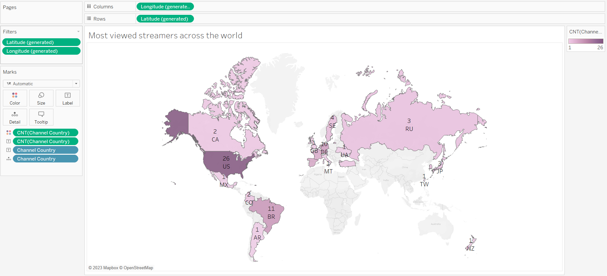

```{r setup, include=FALSE}
knitr::opts_chunk$set(echo = TRUE)

library(ggplot2)
library(dplyr)
library(lubridate)
library(scales)
library(tidyverse)
library(vroom)
library(janitor)
library(skimr)
library(mice) 
library(VIM)
library(plotly)
library(readxl)
library(readr)
library(RColorBrewer)
library(viridis)
```


```{r imports, echo= FALSE, warning = FALSE, message=FALSE}
# Load Twitch game data from CSV files
twitch_data <- read.csv("datasets/Twitch_game_data.csv")
Kick_stats <- read.csv("datasets/Kick stats.csv")
Twitch_global_data <- read.csv("datasets/Twitch_global_data.csv")
Twitch_game_data <- read_csv("datasets/Twitch_Game_Merged.csv") %>% 
  janitor::clean_names() 
df_game <- read_csv("datasets/Twitch_game_data.csv", col_types = cols())

```


# Twitch's Growth

```{r twitch-hours, warning = FALSE}

# Convert 'Year' and 'Month' columns to a single date object
# 'make_date()' creates dates from year and month values
twitch_data$Date <- make_date(twitch_data$Year, twitch_data$Month)

# Summarise 'Hours_watched' and 'Hours_streamed' after grouping by date
monthly_data <- twitch_data %>%
  group_by(Date) %>%
  summarise(Hours_watched = sum(Hours_watched),
            Hours_streamed = sum(Hours_streamed))

# Calculate a scale factor for plotting
scale_factor <- max(monthly_data$Hours_watched) / max(monthly_data$Hours_streamed)

# Define important dates with their corresponding labels and y-axis positions
important_dates <- data.frame(
  Date = as.Date(c("2020-03-01", "2021-10-01", "2022-12-01", "2017-10-1")),
  Label = c("COVID-19 declared as a pandemic", "Massive data leak", "Kick's creation", "Fortnite released"),
  y_position = c(max(monthly_data$Hours_watched * 0.28), 
                 max(monthly_data$Hours_watched * 0.22), 
                 max(monthly_data$Hours_watched * 0.18), 
                 max(monthly_data$Hours_watched * 0.4)))  # Adjust y positions to prevent label overlap

# Creating the plot
p2 <- ggplot(monthly_data, aes(x = Date)) +
  geom_line(aes(y = Hours_watched, colour = "Hours Watched"), size = 1) +
  geom_line(aes(y = Hours_streamed * scale_factor, colour = "Hours Streamed"), size = 1) +
  # Setting new colors
  scale_colour_manual("", 
                      values = c("Hours Watched" = "purple", "Hours Streamed" = "darkgreen")) +
  # Setting labels and title of the plot
  labs(x = "", y = "", title = "TWITCH WATCHED AND STREAMED HOURS OVER TIME") +
  # Applying a minimal theme and customizing the plot appearance
  theme_minimal() +
  theme(legend.position = "bottom",
        plot.title = element_text(face = "plain"),
        axis.text.x = element_text(color = "black"),
        axis.text.y = element_text(color = "black"),
        axis.line.x = element_line(color = "black"),
        axis.line.y.left = element_line(color = "purple"),
        axis.line.y.right = element_line(color = "darkgreen"),
        panel.grid.major = element_blank(),
        panel.grid.minor = element_blank(),
        axis.ticks = element_line(color = "black"),
        legend.background = element_rect(colour = "black"),
        axis.text.y.left = element_text(color = "purple"),
        axis.text.y.right = element_text(color = "darkgreen"),
        axis.ticks.y.right = element_line(color = "darkgreen"),
        axis.ticks.y.left = element_line(color = "purple")) +
  # Setting continuous y-axis and secondary y-axis for 'Hours_streamed'
  scale_y_continuous(sec.axis = sec_axis(~./scale_factor, name = "")) +
  # Adding vertical lines for important dates and labeling them
  geom_vline(data = important_dates, aes(xintercept = Date), linetype = "dashed", color = "grey") +
  geom_text(data = important_dates, aes(x = Date, y = y_position, label = Label), vjust = 1.5, hjust = 0.5, angle = 0, color = "#909495", size = 3) +
  # Customizing the x-axis to show year labels
  scale_x_date(date_breaks = "1 year", date_minor_breaks = "1 month", date_labels = "%Y")

# Print the plot
p2
```

# Kick's Growth


```{r Kick, warning = FALSE}

Kick_stats$Month <- dmy(paste("01-", Kick_stats$Month))

# Remove November from the dataset, it is the most recent month
Kick_stats <- Kick_stats %>%
  filter(Month != max(Month))

# Calculate a scale factor for plotting
scale_factor <- max(Kick_stats$Hours.Watched) / max(Kick_stats$Active.Channels)

# Creating the plot
p5 <- ggplot(Kick_stats, aes(x = Month)) +
  geom_line(aes(y = Hours.Watched, colour = "Hours Watched"), size = 1) +
  geom_line(aes(y = Active.Channels * scale_factor, colour = "Active Channels"), size = 1) +
  scale_colour_manual("", 
                      values = c("Hours Watched" = "purple", "Active Channels" = "coral")) +
  # Setting labels and title of the plot
  labs(x = "", y = "", title = "KICK STREAMING STATISTICS OVER TIME") +
  # Changing theme
  theme_minimal() +
  # Customizing the plot appearance
  theme(legend.position = "bottom",
        plot.title = element_text(face = "plain"),
        axis.text.x = element_text(color = "black"),
        axis.text.y = element_text(color = "black"),
        axis.line.x = element_line(color = "black"),
        axis.line.y.left = element_line(color = "purple"),
        axis.line.y.right = element_line(color = "coral"),
        panel.grid.major = element_blank(),
        panel.grid.minor = element_blank(),
        axis.ticks = element_line(color = "black"),
        legend.background = element_rect(colour = "black"),
        axis.text.y.left = element_text(color = "purple"),
        axis.text.y.right = element_text(color = "coral"),
        axis.ticks.y.right = element_line(color = "coral"),
        axis.ticks.y.left = element_line(color = "purple")) +
  # Setting continuous y-axis and secondary y-axis for 'Active.Channels'
  scale_y_continuous(sec.axis = sec_axis(~./scale_factor, name = "")) +
  # Customizing the x-axis to show abbreviated month names
  scale_x_date(date_breaks = "1 month", date_labels = "%b")

# Print the plot
p5


```

# Viewer Ratios


```{r global-data, warning = FALSE}
# Peek at the data
head(Twitch_global_data)

# Ensure that 'year' and 'Month' are in the correct format
Twitch_global_data$year <- as.integer(as.character(Twitch_global_data$year))
Twitch_global_data$Month <- as.integer(as.character(Twitch_global_data$Month))

# Calculate average viewer ratio for each year
yearly_avg_viewer_ratio <- Twitch_global_data %>%
  group_by(year) %>%
  summarise(AverageViewerRatio = mean(Viewer_ratio, na.rm = TRUE))

yearly_avg_viewer_ratio

skim(Twitch_global_data)
summary(Twitch_global_data$Viewer_ratio)
```


```{r global-data-ratio, warning = FALSE}
# Calculate year-over-year changes
yearly_avg_viewer_ratio <- yearly_avg_viewer_ratio %>%
  arrange(year) %>%
  mutate(Change = (AverageViewerRatio - lag(AverageViewerRatio)) / lag(AverageViewerRatio) * 100)

yearly_avg_viewer_ratio

```


```{r average viewer ratio changes year over year, warning=FALSE}
library(ggplot2)
library(scales)  # For percent_format()

# Assuming 'yearly_avg_viewer_ratio' is a dataframe with 'Year' and 'Change' columns
# Plotting the year-over-year changes
ggplot(data = yearly_avg_viewer_ratio, aes(x = year, y = Change)) +
  geom_col(aes(fill = Change), show.legend = FALSE) +  # Use fill aesthetic for automatic color grading
  scale_fill_gradient2(low = "salmon", high = "lightgreen", mid = "grey", midpoint = 0) +  # Gradient color scheme
  geom_text(aes(label = scales::percent(Change / 100, accuracy = .1)), position = position_stack(vjust = 0.5), color = "black", size = 3.5) +  # Add labels
  theme_minimal(base_size = 14) +  # Clean theme
  theme(
    axis.text.x = element_text(hjust = 1),  # Angle x-axis text
    plot.title = element_text(size = 16, face = "bold"),  # Bold title
    plot.subtitle = element_text(size = 12),  # Subtitle
    panel.grid.major = element_blank(),  # Remove major grid lines
    panel.grid.minor = element_blank(),  # Remove minor grid lines
    panel.background = element_blank()   # Remove panel background
  ) +
  labs(
    title = "Average Viewer Ratio Remains Steady",
    subtitle = "Yearly percentage changes in average viewer ratio",
    x = "Year",
    y = "Year-over-Year Change (%)"
  ) +
  geom_hline(yintercept = 0, linetype = "dashed", color = "darkgrey")   # Reference line at 0%

```


# Correlation with Channels

```{r Viewers and Channels correlations }

# Assuming Twitch_global_data is your dataframe and it has columns for 'year', 'Month', 'Avg_viewers', 'Peak_viewers'

# Create a Date column from year and month
Twitch_global_data$Date <- make_date(Twitch_global_data$year, Twitch_global_data$Month)

# Create the plot with a more gentle color for the bars and smaller points for peak viewers
ggplot(Twitch_global_data, aes(x = Date)) +
  geom_bar(aes(y = Avg_viewers), stat = "identity", fill = "#AEC7E8", alpha = 0.7) + # Lighter blue color
  geom_point(aes(y = Peak_viewers), color = "orange", size = 2) + # Smaller points
  scale_x_date(labels = date_format("%Y"), breaks = date_breaks("1 year")) +
  scale_y_continuous(labels = comma) +
  labs(title = "Surging Popularity",
    subtitle = "Twitch's Rising Average and Peak Viewership Trends",
       x = "Year",
       y = "Viewers") +
  
theme_minimal() + 
  theme(
    plot.title = element_text(face = "bold"),
    panel.grid = element_blank(),
    
    axis.text.x = element_text(vjust = 0.5, hjust=1))
```


# Genres

```{r Genre Analysis, warning = FALSE}

# Select the top 10 genres by total hours watched
top_10_genres <- Twitch_game_data %>%
  group_by(genre) %>%
  summarise(Total_hours_watched = sum(hours_watched)) %>%
  arrange(desc(Total_hours_watched)) %>%
  filter(genre != "Shooter") %>%
  top_n(5)

# Filter Twitch_genre_perf to include only the top 10 genres
top_10_data <- Twitch_game_data %>%
  filter(genre %in% top_10_genres$genre) %>% 
  group_by(genre, year) %>% 
  summarise(Total_hours_watched = sum(hours_watched))


Top10_genres_watched <- ggplot(top_10_data, aes(x = year, y = Total_hours_watched, fill = genre)) +
  geom_area() +
  labs(title = "Evolution of Top 10 Genres",
       x = "Year",
       y = "Total Hours Watched") +
  theme_minimal() +
  theme(panel.grid = element_blank(),  # Remove all gridlines
        legend.position = c(0.01, 0.99),  # Top left corner
        legend.justification = c(0.01, 0.99),  # Top left corner
        legend.box.margin = margin(0, 0, 0, 0),  # Reduce margin around legend
        legend.margin = margin(0, 0, 0, 0))  # Reduce margin around legend


Top10_genres_watched

```


```{r Share of Genre Analysis, warning = FALSE}
# Select the top 10 genres by total hours watched
top_10_genres <- Twitch_game_data %>%
  group_by(genre) %>%
  summarise(Total_hours_watched = sum(hours_watched)) %>%
  arrange(desc(Total_hours_watched)) %>%
  top_n(10)

# Filter Twitch_genre_perf to include only the top 10 genres
top_10_data <- Twitch_game_data %>%
  filter(genre %in% top_10_genres$genre) %>% 
  group_by(genre, year) %>% 
  summarise(Total_hours_watched = sum(hours_watched))

# Create a new column to identify if the genre is in the top 10 or not
Twitch_game_data <- Twitch_game_data %>%
  mutate(is_top_10 = ifelse(genre %in% top_10_genres$genre, "Top 10", "Others"))

total_hours_by_group <- Twitch_game_data %>%
  group_by(year, is_top_10) %>%
  summarise(Total_hours_watched = sum(hours_watched)) %>% 
  mutate(Percentage = (Total_hours_watched / sum(Total_hours_watched)) * 100)

# Plotting the stacked bar chart
Proportion_top10 <- ggplot(total_hours_by_group, aes(x = year, y = Total_hours_watched, fill = is_top_10)) +
  geom_bar(stat = "identity") + 
  labs(title = "Proportion of Watching Hours Over Time",
       x = "Year",
       y = "Total Hours Watched",
       fill = "Genre Group") +
  scale_fill_manual(values = c("Top 10" = "red", "Others" = "gray")) +  # Set colors for the groups
  theme_minimal() + 
  theme(panel.grid = element_blank(),
        legend.position = c(0.01, 0.99),  # Top left corner
        legend.justification = c(0.01, 0.99),  # Top left corner
        legend.box.margin = margin(0, 0, 0, 0),  # Reduce margin around legend
        legend.margin = margin(0, 0, 0, 0)) +  # Reduce margin around legend
  
  geom_text(aes(label = sprintf("%.1f%%", Percentage)),
            position = position_stack(vjust = 0.5), 
            color = "white", 
            size = 3)

#ggsave("Proportion_top10.png", plot = Proportion_top10, width = 10, height = 6, units = "in")


Proportion_top10


```


# Drilling down for Games

```{r line-graph, warning = FALSE}

print(df_game)
print(head(df_game))

# Check for missing values
print(sum(is.na(df_game$Game)))

# Drop rows with missing 'Game' values
df_game_clean <- df_game %>% filter(!is.na(Game))

# Grouping data by 'Game' and 'Year', and summing a particular column (e.g., 'Hours Watched')
dummydf <- 
  df_game_clean %>% 
  group_by(Game) %>% 
  summarise(Total_Hours = sum(Hours_watched, na.rm = TRUE))%>%
    arrange(desc(Total_Hours)) %>%
  slice_max(order_by = Total_Hours, n = 5)


#Creating a grouped data frame for values present in dummy df
grouped_data <- 
  df_game_clean %>% 
  group_by(Game, Year) %>% 
  summarise(Total_Hours = sum(Hours_watched, na.rm = TRUE))%>%
  filter(Game %in% dummydf$Game)%>%
  arrange(desc(Total_Hours)) 

# Example plot (adjust according to specific requirements)
ggplot(grouped_data, aes(x = Year, y = Total_Hours, group = Game, color = Game)) +
  geom_line(size = 1) +
  theme_minimal() + 
  theme(panel.grid = element_blank(),
        legend.position = c(0.01, 0.99),  # Top left corner
        legend.justification = c(0.01, 0.99),  # Top left corner
        legend.box.margin = margin(0, 0, 0, 0),  # Reduce margin around legend
        legend.margin = margin(0, 0, 0, 0),
        legend.title = element_blank()) +  # Reduce margin around legend
  labs(y='Total Hours Watched',
       title = 'Evolution of Top Games on Twitch')+

  scale_color_brewer(palette="Dark2")


```


```{r bar-1}

#Creating a grouped data frame for values for 2023
grouped_data <- 
  df_game_clean %>% 
  filter(Year == '2023') %>% 
  group_by(Game) %>% 
  summarise(Total_Hours = sum(Hours_watched, na.rm = TRUE))%>%
  slice_max(order_by = Total_Hours, n = 10) %>% 
  arrange(desc(Total_Hours)) %>% 
  mutate(Game = fct_reorder(Game, Total_Hours))

# Plot
ggplot(grouped_data, aes(x = Total_Hours , y = Game, fill = Total_Hours)) +
  geom_col(show.legend = FALSE) +
  theme_minimal() + 
  theme(panel.grid = element_blank()) +  # Disable gridlines
  labs(x='Total Hours Watched',
       title = 'Most Viewed Games on Twitch in 2023')+
  scale_fill_viridis(option = 'cividis',direction = -1) #Reversing the cividis palette

```


```{r bar-2}

#Creating a grouped data frame for values for 2023
grouped_data <- 
  df_game_clean %>% 
  filter(Year == '2023') %>% 
  group_by(Game) %>% 
  summarise(Avg_viewers = mean(Avg_viewers, na.rm = TRUE))%>%
  slice_max(order_by = Avg_viewers, n = 10) %>% 
  arrange(desc(Avg_viewers)) %>% 
  mutate(Game = fct_reorder(Game, Avg_viewers))

# Plot
ggplot(grouped_data, aes(x = Avg_viewers , y = Game, fill = Avg_viewers)) +
  geom_col(show.legend = FALSE) +
  theme_minimal() + 
  theme(panel.grid = element_blank()) +  # Disable gridlines
  labs(x='Average Viewers',
       title = 'Top Games on Twitch in 2023 (Based on Average Viewers)')+
  scale_fill_viridis(option = 'rocket',direction = -1) #Reversing the rocket palette

```


#Tableau Screenshots

```{r screenshots}

#Distribution of top streamers in the World. Used Tableau to render on a world map
 

#Treemap created in Tableau
 

```

